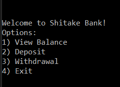
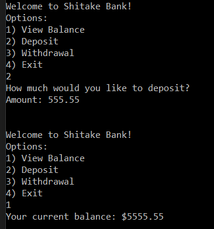
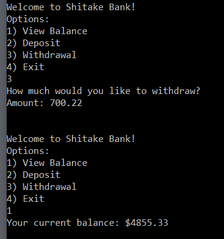
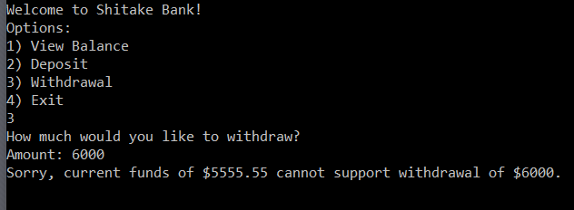
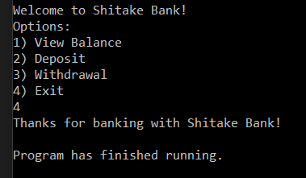

# Console Generic ATM

Lab02-Unit-Testing

*Author: Chris Cummings*

*Collaborators: Darrik Puetz - On Environment.Exit*

----

## Description
This is a console application that mimics an ATM. There is a starting balance which can be manipulated
through the use of deposits and withdrawals. Unit Testing has been done for each banking function.

---

### Getting Started
Clone this repository to your local machine.

```
$ git clone https://github.com/cdcummings10/Lab02--ATM.git
```

### To run the program from Visual Studio:
Select ```File``` -> ```Open``` -> ```Project/Solution```

Next navigate to the location you cloned the Repository.

Double click on the ```Lab02--ATM``` directory.

Then select and open ```ATM.sln```

Click on ```Start```

### To run the executable:

Navigate to folder ```Lab01--ATM``` directory.

Navigate through these folders: ```ATM``` => ```ATM``` => ```bin``` => ```Debug```

Run ```ATM.exe```

---

### Visuals

#### Application Start

#### Deposit

#### Withdraw

#### Withdraw Error

#### Application Exit


---

### Time Estimates
Estimated time to finish: 4 Hours

Actual time to finish: 2 Hours

### Change Log 

1.0: *Finished ATM. Added all functionality to app.* - 16 Oct 2019
